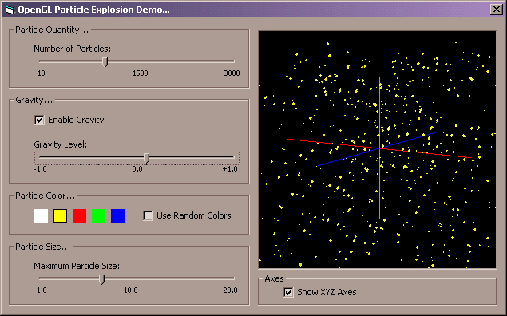



## OpenGL 3D Particle Explosion Demonstration

### Description

This program demonstrates how to create a particle explosion in three-dimensional space using OpenGL from within Visual Basic. The user can select the number of particles in the explosion, and can select the size of the particles in the explosion as well. The user can also choose to implement either positive or negative gravity in the scene, and watch how the gravity affects the particles. Other options include the abilty to select the color of the particles, including random colors, and to show or hide the XYZ coordinate axes. This program is a great way to learn about simple particle systems. NOTE: This program requires Microsoft's OpenGL type library for Visual Basic, and as such I have included it in the ZIP file. Enjoy, and let me know what you think!
 
### More Info
 
Again, this program requires Microsoft's OpenGL type library for Visual Basic, and as such I have included it in the ZIP file.

             |
---                |---
**Submitted On**   |2001-05-17 16:16:14
**By**             |[Daniel S\. Soper](https://github.com/Planet-Source-Code/PSCIndex/blob/master/ByAuthor/daniel-s-soper.md)
**Level**          |Advanced
**User Rating**    |5.0 (10 globes from 2 users)
**Compatibility**  |VB 6\.0
**Category**       |[Graphics](https://github.com/Planet-Source-Code/PSCIndex/blob/master/ByCategory/graphics__1-46.md)
**World**          |[Visual Basic](https://github.com/Planet-Source-Code/PSCIndex/blob/master/ByWorld/visual-basic.md)
**Archive File**   |[OpenGL 3D 197195172001\.zip](https://github.com/Planet-Source-Code/daniel-s-soper-opengl-3d-particle-explosion-demonstration__1-23241/archive/master.zip)

